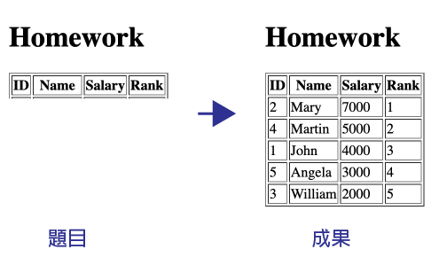

# 00_基礎語法

## Agenda
1. 如何執行PHP代碼
    - 簡介 server-client base 的 Web 服務
    - PHP 在架構裡的角色
    - 執行PHP代碼的方式
2. 變數型態
3. 常用語法
4. 隨堂測驗
5. 作業

## Slides
- [00 基礎語法](https://docs.google.com/presentation/d/1d0vnXKu-xZhjIBIfP1HT-ErSdTOBjHkLxA6UN59dvU8)

## Homework
- [將後端的資料呈現到前端](./homework/homework1.php)

## Answer
- coming soon